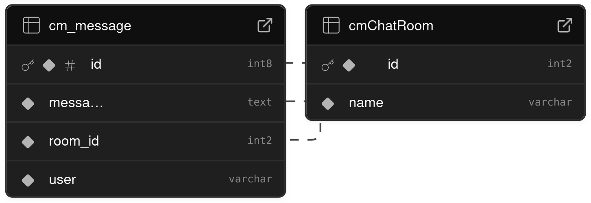

# Chaticus Maximus server

## A chat server.

Uses socket.io, express and Supabase. 

The user can divide up the page into several chat windows with drag and drop.

Create a nodejs typescript project.

npm install 
socket.io 
express 
@types/express
@supabase/supabase-js 

"npm start" to start the server.

